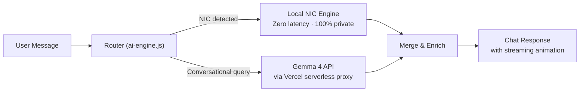

# AI NIC Assistant — Hybrid Local + Gemma 4 API Architecture

Build a premium, Claude-style AI chat interface for NIC Info that combines **local NIC decoding intelligence** with **Google Gemma 4 API** for natural language conversation — the best of both worlds.

## Architecture: Dual-Engine Hybrid



**How the two engines work together:**

| Scenario | Local Engine | Gemma 4 API | Example |
|----------|-------------|-------------|---------|
| User pastes a NIC number | ✅ Decodes instantly | ✅ Generates conversational summary, fun facts, zodiac sign, etc. | "941234567V" → Local decodes DOB/age/gender → Gemma narrates it naturally |
| User asks "how does NIC work?" | ❌ Not triggered | ✅ Provides rich explanation | Natural language educational response |
| User says "compare these NICs" | ✅ Decodes both locally | ✅ Generates comparison narrative | Both engines contribute to the response |
| API is down / offline | ✅ Full NIC decoding works | ❌ Graceful fallback | Local engine provides structured results with a notice |
| User asks unrelated question | ❌ Not triggered | ✅ Handles freely | Gemma responds conversationally |

---

## Proposed Changes

### Component 1: Vercel Serverless API Proxy

#### [NEW] [api/gemma.js](file:///d:/nic-info/api/gemma.js)

Serverless function that proxies requests to Google's Gemini API (Gemma 4 model), keeping the API key secure on the server.

**Key features:**
- `POST /api/gemma` endpoint
- Reads `GEMMA_API_KEY` from Vercel environment variables (never exposed to client)
- Calls `https://generativelanguage.googleapis.com/v1beta/models/gemma-4-12b-it:generateContent`
- Supports **streaming responses** via `streamGenerateContent` for real-time token-by-token output
- Rate limiting headers to prevent abuse
- CORS restricted to same-origin
- Error handling with structured JSON error responses
- Request body validation (max message length, sanitization)

**System prompt engineering** — the proxy injects a carefully crafted system prompt:
```
You are the NIC Info AI Assistant, a friendly expert on Sri Lankan National Identity Cards. 
You help users understand NIC formats, decode NIC numbers, and learn about the Sri Lankan 
identity system. You are concise, accurate, and conversational.

Key rules:
- When the user provides NIC decoded data, narrate it naturally with personality
- Add relevant context: zodiac sign from DOB, generation info, historical context
- Never make up NIC numbers or personal data
- Maintain the privacy-first ethos of NIC Info
- Keep responses concise (2-4 paragraphs max)
- Format responses with markdown when helpful
```

**Environment variable setup:**
```
GEMMA_API_KEY=your-google-ai-studio-api-key
```

---

### Component 2: Chat Page

#### [NEW] [ai-assistant.html](file:///d:/nic-info/ai-assistant.html)

Premium Claude-style chat interface:

**Welcome State:**
- Hero section: sparkle icon + "NIC AI Assistant" title
- Subtitle: "Powered by local intelligence + Gemma 4 AI"
- 4–6 clickable starter prompt cards (glass-card style):
  - "🔍 Decode my NIC number"
  - "📖 How does NIC encoding work?"
  - "🔄 Convert old NIC to new format"
  - "⚖️ Compare old vs new NIC format"
  - "🎯 What does V or X mean?"
  - "📅 Find birthday from NIC"

**Chat Interface:**
- Full-height viewport with scrollable message area
- **User messages:** Right-aligned, brass accent border, dark card
- **Assistant messages:** Left-aligned, paper-colored card with subtle glassmorphism
- **Inline NIC result cards:** When a NIC is decoded, a structured result card (DOB, age, gender, weekday, format) appears inside the assistant's message — reusing existing design language
- **Streaming text animation:** Gemma 4 responses stream in token-by-token for a premium "AI thinking" feel
- **Typing indicator:** Three bouncing dots animation while waiting for API
- **Follow-up suggestions:** Clickable chips appear after each response ("Tell me more", "Decode another", "What's the zodiac sign?")
- **Copy button** on each assistant message
- **Status indicator:** Shows "Local" (green dot) or "AI" (purple dot) for each response source

**Input Area (bottom-pinned):**
- Auto-expanding textarea (1–5 rows)
- Send button with arrow icon
- `Enter` to send, `Shift+Enter` for newline
- Character counter (max 1000 chars)
- Privacy badge: "🔒 NIC data never leaves your device"

**Header:**
- Same header as rest of site with nav links
- "AI Assistant" badge with sparkle icon
- Status pill: "Online" (green) / "Offline Mode" (amber)

---

### Component 3: Local NIC Intelligence Engine

#### [NEW] [ai-engine.js](file:///d:/nic-info/ai-engine.js)

The client-side brain that handles NIC-specific operations with zero latency:

**NIC Detection & Extraction:**
- Regex scanner that finds NIC numbers anywhere in user messages
- Supports old format (`941234567V`) and new format (`199412345678`)
- Multi-NIC detection: finds all NICs in a single message

**Local Decode Pipeline:**
- Reuses the proven decode logic from [index.html](file:///d:/nic-info/index.html) (lines 1700–1960)
- Extracts: DOB, age (years/months/days), gender, weekday, voter status, day-of-year, format conversion
- Returns structured data object for rendering

**Smart Router:**
```javascript
async function processMessage(userMessage) {
  // 1. Extract any NIC numbers from the message
  const nics = extractNICs(userMessage);
  
  // 2. Decode NICs locally (instant, private)
  const localResults = nics.map(nic => decodeNIC(nic));
  
  // 3. Build context for Gemma 4
  const enrichedPrompt = buildPrompt(userMessage, localResults);
  
  // 4. Call Gemma 4 API for conversational response
  const aiResponse = await callGemmaAPI(enrichedPrompt);
  
  // 5. Merge: structured NIC cards + AI narrative
  return {
    nicCards: localResults,      // Rendered as structured cards
    narrative: aiResponse,       // AI-generated conversational text
    source: nics.length > 0 ? 'hybrid' : 'ai',
    suggestions: generateSuggestions(userMessage, localResults)
  };
}
```

**Context Management:**
- Maintains conversation history (last 10 messages) for multi-turn context
- Remembers last decoded NIC for follow-up questions
- Builds context-aware prompts for Gemma 4

**Fallback Logic:**
- If API call fails → returns local results with a structured fallback message
- If API is slow (>8s timeout) → shows local results first, appends AI response when ready
- Offline detection via `navigator.onLine`

**Format Conversion:**
- Old → New NIC conversion with step-by-step breakdown
- New → Old NIC conversion (when applicable)

**Batch Processing:**
- "Decode these: 941234567V, 199412345678" → decodes all locally, sends batch to Gemma for comparative analysis

---

### Component 4: Chat Styles

#### [MODIFY] [styles.css](file:///d:/nic-info/styles.css)

Add ~500 lines of CSS for the chat interface:

**Design system alignment:**
- Uses existing tokens: `--ink-900`, `--paper`, `--brass`, `--teal`, `--signal`
- Full dark/light mode support via `[data-theme]`
- Glassmorphism on assistant message cards
- Consistent with existing Fraunces + IBM Plex typography

**Key CSS components:**
- `.chat-page` — Full viewport layout
- `.chat-viewport` — Scrollable message area with custom scrollbar
- `.chat-welcome` — Welcome state with grid of prompt cards
- `.chat-bubble`, `.chat-bubble--user`, `.chat-bubble--assistant` — Message styling
- `.chat-nic-card` — Inline decoded NIC result card
- `.chat-input-bar` — Bottom-pinned input area
- `.chat-typing-indicator` — Bouncing dots animation
- `.chat-suggestion-chip` — Follow-up prompt pills
- `.chat-source-badge` — "Local" / "AI" source indicator
- `.chat-status-pill` — Online/Offline status

**Animations:**
- Message entrance: slide-up + fade-in (150ms stagger)
- Typing indicator: three dots with 200ms bounce delay
- Streaming text: character-by-character opacity reveal
- NIC card: expand-in animation when decoded

---

### Component 5: Navigation & Routing Updates

#### [MODIFY] [vercel.json](file:///d:/nic-info/vercel.json)

```diff
 "rewrites": [
+  {
+    "source": "/ai-assistant",
+    "destination": "/ai-assistant.html"
+  },
   {
     "source": "/old-to-new-nic",
```

#### [MODIFY] [index.html](file:///d:/nic-info/index.html)

- Add "AI Assistant ✨" link to desktop nav (`<nav class="header-nav">`)
- Add "AI Assistant ✨" link to mobile drawer (`<div class="mobile-nav-drawer">`)
- Add a CTA banner below the hero section:
  ```
  ✨ New! Ask our AI Assistant anything about Sri Lankan NIC numbers
  [Try AI Assistant →]
  ```

#### [MODIFY] [sitemap.xml](file:///d:/nic-info/sitemap.xml)

Add:
```xml
<url>
  <loc>https://nicinfo.vercel.app/ai-assistant</loc>
  <lastmod>2026-09-19</lastmod>
  <changefreq>weekly</changefreq>
  <priority>0.9</priority>
</url>
```

#### [MODIFY] [llms.txt](file:///d:/nic-info/llms.txt)

Add documentation for the AI Assistant feature under a new section.

---

## Recommended Features (Included in Build)

1. **🧠 Hybrid Responses:** NIC cards rendered instantly by local engine + AI narrative streams in from Gemma 4
2. **⚡ Streaming Animation:** Token-by-token text reveal using `streamGenerateContent` API
3. **🔄 Smart Fallback:** If API is down, local engine provides full NIC results with structured responses
4. **📊 Batch Decode:** "Compare 941234567V and 199412345678" → side-by-side NIC cards + AI comparison
5. **📋 Copy Response:** One-click copy on each assistant message
6. **⌨️ Keyboard Shortcuts:** `Enter` to send, `Shift+Enter` for newline, `Esc` to clear
7. **💾 Session Memory:** Conversation persists during session, conversation context for follow-ups
8. **🌙 Dark/Light Mode:** Inherits site theme seamlessly
9. **📱 Mobile-First:** Responsive design, touch-friendly, no horizontal scroll
10. **🔒 Privacy Indicator:** "NIC data decoded locally — never sent to servers" badge (NIC numbers are decoded locally; only the conversation context is sent to Gemma)

---

## File Summary

| File | Action | Purpose |
|------|--------|---------|
| `api/gemma.js` | **NEW** | Vercel serverless proxy for Gemma 4 API |
| `ai-assistant.html` | **NEW** | Chat page with Claude-style interface |
| `ai-engine.js` | **NEW** | Local NIC decoder + smart router + Gemma API client |
| `styles.css` | MODIFY | Add ~500 lines of chat-specific CSS |
| `vercel.json` | MODIFY | Add `/ai-assistant` rewrite |
| `index.html` | MODIFY | Add nav links + CTA banner |
| `sitemap.xml` | MODIFY | Add new URL entry |
| `llms.txt` | MODIFY | Document AI Assistant feature |

---

## Environment Setup Required

Before deploying, you need to:

1. **Get Gemma 4 API key** from [Google AI Studio](https://aistudio.google.com/apikey)
2. **Add to Vercel environment variables:**
   - Go to Vercel Dashboard → Your Project → Settings → Environment Variables
   - Add: `GEMMA_API_KEY` = `your-api-key-here`
3. **Deploy** — Vercel auto-detects the `/api` directory and creates the serverless function

---

## Verification Plan

### Automated Testing
- Test serverless function locally with `vercel dev`
- Verify API proxy returns valid Gemma responses

### Manual Verification

**Functional:**
- Decode a NIC via chat and verify DOB/age/gender matches existing decoder
- Test multi-NIC batch decode
- Test format conversion in chat context
- Verify follow-up context ("what's their zodiac sign?" after decoding)
- Test API fallback by disconnecting network
- Test streaming response animation

**UI/UX:**
- Mobile (375px), tablet (768px), desktop (1440px)
- Dark/light mode toggle
- Auto-scroll on new messages
- Input auto-expand behavior
- Keyboard shortcuts

**Security:**
- Confirm API key is NOT visible in browser DevTools network tab
- Verify serverless function rejects non-POST requests
- Test with invalid/malicious input
